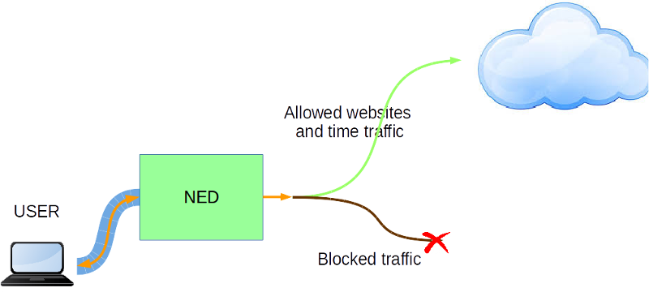
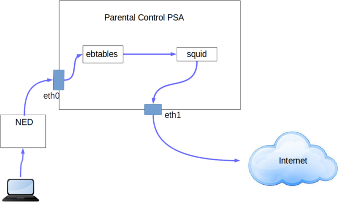

# 1. End-user 

## 1.1 Description / general readme

Today, thanks to the Internet we can easily and quickly, and usually without any restriction, access to information of any topic. This means even the youngest in the family can get into any website anytime and this can be a problem when the child is in front of the computer all day. 

For this reason, this PSA offers the parents the possibility to manage the times and websites which are allowed or blocked.



## 1.2 Features / Capabilities

The list of capabilities are (extracted from manifest):

* Filtering_L7: Allows to filter the traffic
* Timing: Allows to set the time interval the rule is operative. 

The internal used technologies are:
* Squid
* iptables
* ebtables
* jq

## 1.3 Security policy examples

"father;no_authorise_access;Internet_traffic;(type_Content,gambling);"


* This rule forbids the traffic to the contents like gambling

"father;no_authorise_access;Internet_traffic;(specific_URL,www.upc.edu)"

* This rule forbids the traffic to an specific url. In this case to www.upc.edu

## 1.4 Support, troubleshooting / known issues

If you find any issue please contact us.

# 2. Developer / admin

## Description / general readme

The Parental Control PSA pretends to offer the possibility to block all the traffic the user wants to block. The most clear example is the father who wants to manage the websites his child can access to. This PSA allows to manage the time interval in the day a concret website (or more than one) is available also.

The PSA acts like a transparent proxy managed by Squid. 




## Components and Requirements

VM technology allows creating a full system for the PSA. The components used in this PSA are:

* Operative System: Debian 7 "wheezy"
* iptables 
* ebtables
* brigde-utils
* squid3
* jq

There are no extra requirements apart from the correct user configuration passed to the PSA.

## Detailed architecture

There are several components in the internal architecture:

* **Inspect and route traffic**. **ebtables** is used to set up rules to inspect Ethernet frames between eth0 and eth1 and force the traffic to be routed instead of being just bridged. By this, the traffic will be routed through the Squid proxy. 

* **Filter the traffic**. **Squid** check all the traffic, blocking it if the user configuration indicates it must be blocked.

### Rules

There are no rules

### Certificates

There are no needed certificates


## Virtual machine image creation

The procedure to create a valid PSA image from scratch start with the prerequisite instructions defined in  [PSA Developer guide](https://gitlab.secured-fp7.eu/secured/secured/blob/master/WP5/PSA_dev_guide.md) to obtain a valid base image for PSA. 

Install the software Squid:

	sudo apt-get install squid3

Copy the necessary [files](PSA) of this project in the folder:

```
$HOME/phytonScript/
```

## Mobility Support
This PSA supports the mobility scenario.

## Support, troubleshooting / known issues

If you find any issue please contact us.

## Files required

No extra files required.

### PSA application image

PSA is based on a Virtual machine image in KVM- kernel module format ".qcow2". A [sample image has been included](https://vm-images.secured-fp7.eu/images/priv/parentalcontrol.img) in the project.

### Manifest
* XML 

The PSA manifest in format XML is available at [Manifest](NED_files/TVDM/PSAManifest/parentalcontrolPSA.xml).
This file must be stored in the PSAR. And reflects the capabilities described below. 
* JSON
The PSA manifest is available at [Manifest](NED_files/TVDM/PSAManifest/parentalcontrolPSA).


### HSPL

The HSPL format is defined as follows:

* D4.1 format:


```father;no_authorise_access;Internet_traffic;(type_Content,gambling);```
```father;no_authorise_access;Internet_traffic;(specific_URL,www.upc.edu)```

* More friendly:

```Father does not authorise access to this type the type of content gambling```

```Father does not authorise access to the url www.upc.edu```

### MSPL

The MSPL can be found [here](https://gitlab.secured-fp7.eu/secured/spm/blob/M2LService/M2LService/code/M2LPluginDansguardian/new_MSPL/MSPL_6ec83cfb-5665-4532-8537-69a776294500.xml)

### M2L Plug-in

The M2l plug-in is available at [M2LPlugin](https://gitlab.secured-fp7.eu/secured/spm/blob/M2LService/M2LService/code/M2LPluginDansguardian/src/eu/securedfp7/m2lservice/plugin/M2LPlugin.java)

This plugin do not need additional external information in this version that must be store in the PSAR.

## Features/Capabilities

The list of capabilities are (extracted from manifest):

* Filtering_L7: Allows to filter the traffic
* Timing: Allows to set the time interval the rule is operative.

## Testing

Testing scripts are available at [test folder](tests/)


# 3. License

Please refer to project LICENSE file.

This software incorporates Squid and it is open source software licensed under the [GNU GPL](http://www.gnu.org/licenses/gpl-3.0.en.html).

# Additional Information 
## Partners involved

* Application: UPC
* MSPL: POLITO,UPC 
* M2L Plugin: UPC

# Status (OK/No/Partial) -*OK*-

# TODO:
* Tests
